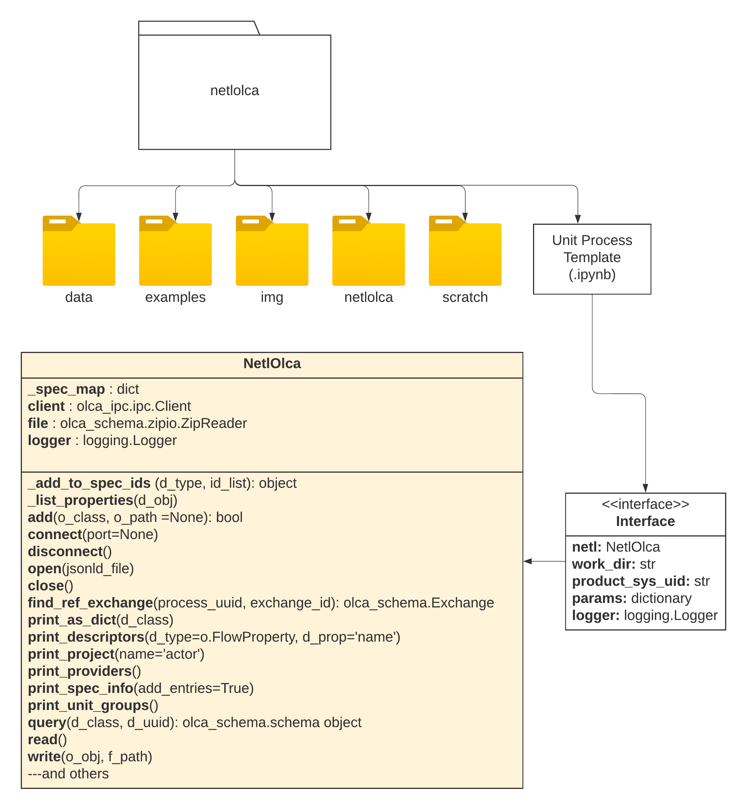

# NETL's Unit Process Template and Report Generator
A Jupyter Notebook for developing and reporting NETL LCA unit processes.

The foundation of all tools in this package is the [NetlOlca](https://doi.org/10.18141/2503973) class, which is designed to provide a single set of methods for querying and editing openLCA databases either directly with openLCA app or indirectly via exported JSON-LD zip files.


## Jupyter Notebook Unit Process Template
One of the main use cases for this tool is a new template based on Jupyter Notebook for reporting LCA unit processes.

The new template is provided at the top-level of this repository (up_template.ipynb).



Two additional classes were developed to support this interactive report generator:

1. NetlOlcaReport (netlolca/NetlOlcaReport.py)
2. Interface (netlolca/Interface.py)

The NetlOlcaReport class provides intermediate methods for converting openLCA entity data into usable data frames and generating a summary of the results into a markdown format that can be converted into other reportable formats (e.g., HTML, Microsoft Word, and PDF).
The file format conversion depends on a user's local installation of [pandoc](https://pandoc.org/), a free and open-source tool for converting between different markup formats.

The recommended app for running the UP Template is [JupyterLab](https://jupyter.org/), the latest web-based interactive development environment for computational notebooks.
JupyterLab may be installed using Python's `pip` or conda's `install` commands.
To start Jupyter Lab, run the following command (after installing) in the parent folder where your up_template.ipynb is located:

```bash
$ jupyter lab
```

This should start the Jupyter notebook server and automatically launch the landing page in your default web browser.


## Repository Organization

    up-template/
    ├── calculations/   <- store for auxiliary Excel workbooks to document
    │   │                  calculations in the UP template
    │   └── calculation_template.xlsx   <-- template for calculations
    │
    ├── data/           <- empty folder for data files (e.g., JSON-LD)
    │
    ├── dockers/ (for getting things to run in Docker)
    │   ├── gdt_server/
    │   │   ├── README.md
    │   │   ├── build.bat
    │   │   ├── build.sh
    │   │   ├── run.bat
    │   │   └── run.sh
    │   └── jupyter/
    │       ├── README.md
    │       ├── build.bat
    │       ├── build.sh
    │       ├── run.bat
    │       └── run.sh
    │
    ├── docs/           <- Sphinx documentation (e.g. user's guide)
    │   ├── source/          <- source files for building documentation
    │   ├── make.bat         <- Windows / *nx make files for building
    │   └── Makefile         <- source files to documentation (e.g., html)
    │
    ├── img/            <- image resources for notebooks and README
    │   ├── banner.png (293 KB)
    │   ├── boundary_diagram.png (205 KB)
    │   ├── logo_doe-netl_white_1000x176.png (30 KB)
    │   ├── netl_logo_100x52.png (14 KB)
    │   ├── netl_logo_1153x599.png (26 KB)
    │   ├── netl_logo2.svg (2 KB)
    │   ├── netl_logo2_320x251.png (13 KB)
    │   └── package_uml.png (281 KB)
    │
    ├── (output/)       <- Created when running UP Template to store the
    │                      generated reports (e.g., .md, .html, .docx, .pdf)
    │
    ├── resources/
    │   ├── after_body.html
    │   ├── before_body.html
    │   ├── banner.png
    │   ├── netl_logo_100x52.png
    │   ├── logo_doe-netl_white_1000x176.png
    │   ├── (other logo files?)
    │   └── template.docx
    │
    ├── up_template/       <- Source code for this package.
    │   ├── __init__.py               <- Makes this a Python package.
    │   ├── Interface.py              <- Class for menu-driven UP template.
    │   └── NetlOlcaReport.py         <- Class for UP report generation.
    │
    ├── .gitignore        <- Git repo ignore list
    ├── LICENSE           <- Package licensing information; CC0 1.0
    │                        https://creativecommons.org/publicdomain/zero/1.0/
    ├── README.md         <- The top-level README.
    ├── setup.py          <- Makes package pip installable (`pip install -e .`)
    │                        (see Installation section for troubleshooting)
    └── up_template.ipynb <- Unit Process development template.


## Sphinx Documentation
The following describes the steps takes to create the documentation (under docs/source).
Note that for rendering the documentation, only the last step is necessary.

| `Graphviz <https://graphviz.org/download/>`_ is a third-party software dependency (similar to pandoc) for generating UML diagrams within the documentation.
| Installation of this free software is available across all major operating systems.
| If unavailable, please remove the blocks in the documentation that use graphviz before rendering (e.g., graphviz and inheritance_diagram).

1. Install Sphinx Python package (version 7.2.6)

    ```command
    $ pip install sphinx
    ```

2. Create docs folder in repository
3. Run quick start

    ```command
    $ sphinx-quickstart
    ```

4. Configuration:
    - Create separate build and source folders
5. Modify the conf.py file in source
    - Add top-matter for path correction (need access to one level up)
    - Add extensions for:
        * autodoc (generate documentation based on source code),
        * mathjax (add support for rendering math equations)
        * napolean (add support for numpy-style documentation)
        * graphviz (add support for UML diagrams)
        * inheritance_diagram (for hyperlinked image to class doc)
    - Turn on figure, table, section numbering
    - Set theme to 'alabaster'
    - Add logo
6. Run autodoc

    ```command
    $ sphinx-autogen
    ```

7. Correct the modules.rst file
    - Remove the setup.py script
8. Modify the index.rst file
    - Add individual pages to the TOC
9. Render the site

    ```command
    $ make html
    ```
