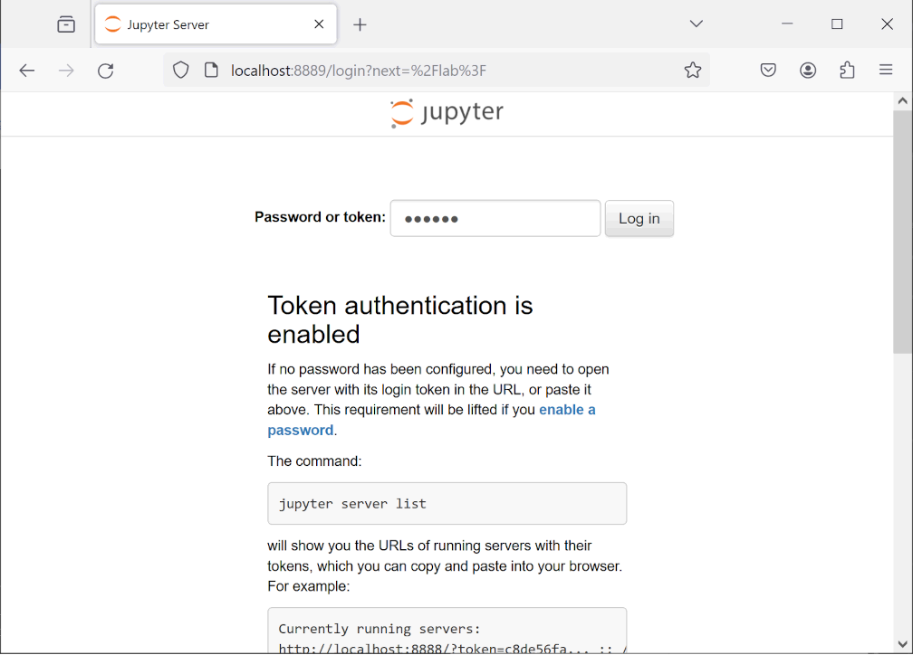

# Docker User Guide

This guide will walk you through the process of setting up and using GreenDelta's GDT server (a bespoke Java-based web service), OpenLCA database, and JupyterLab environment inside Docker containers.

**Please follow these steps carefully to ensure a smooth experience.**

A glossary of terms is available at the bottom of this guide.


## Prerequisites

The following methods assume you have cloned this repository.
It is also assumed that you have openLCA v2.0 installed, which creates a folder, openLCA-data-1.4 in your home folder.


## Methods

### Installation and First Use

1.  Download [Docker Desktop](https://www.docker.com/products/docker-desktop/), an app that runs on Microsoft Windows and macOS.

    -   **Windows Installation**: you need virtualization enabled and the Windows Subsystem Linux (WSL) installed to run Docker.

        1.  Virtualization can be checked on Windows in Task Manager \> Performance \> CPU \> Virtualization

        2.  The WSL on Windows can be installed on an Administration Command Prompt running: `wsl --install (-d Ubuntu)`

    -   Note that the installation may require you to restart your computer.

    -   Agree to the service statement and policies.

    -   Use recommended settings to finish installation.

    -   You do not need a user account to run Docker, continue without signing in.

2.  Make sure Docker is installed and running. For example, open Command Prompt on Windows (or terminal on macOS) and type the following command (you should get a version number printed back).

    ```bash
    docker --version
    ```

3.  Create the two Dockerfiles.

    The scripts are found in the sub-folders for the two docker images (i.e., 'gdt-server' and 'jupyter').
    Run the get-docker script for your operating system for both Docker images.

    On macOS, run

    ```bash
    cd dockers/gdt-server
    bash get-docker.sh
    cd ../jupyter
    bash get-docker.sh
    ```

    On Windows, run:

    ```
    cd dockers\gdt-server
    cmd /c get-docker.bat
    cd ..\jupyter
    cmd /c get-docker.bat
    ```

4.  Build the custom JupyterLab image as defined in the Dockerfile (note that build.bat and Dockerfile should be in the same folder, and open Command Prompt or Bash terminal in this folder). To navigate Command Prompt or Terminal to your folder location use the \"cd\" command and the file path (e.g., `cd dockers\\jupyter`).

    -   On Windows command prompt: `cmd /c build.bat`

    -   On bash (Linux/macOS): `bash build.sh`

5.  Execute the run script.

    -   On Windows command prompt: `cmd /c run.bat`

    -   On bash (Linux/macOS): `bash run.sh`


    Understanding the run script:

    > docker run -it \--rm \^
    >
    > -p 8889:8888 \^
    >
    > \--name jupyter \^
    >
    > -v %CUSTOM_REPO_DIR%:/home/jovyan/work \^
    >
    > -d my-custom-jupyter \^
    >
    > start-notebook.py \--NotebookApp.token=\'docker\'

    -   **run** creates a container from an existing image (i.e., my-custom-jupyter) and runs a command inside it

    -   **-it** runs interactive shell

    -   **\--rm** will automatically delete the container when you stop the execution

    -   **-p 8889:8888** binds the 8889 host port to the 8888 docker port

    -   **\--name** assigns a descriptive name to the container (e.g., jupyter); otherwise, a randomly generated name will be used

    -   **-v \$CUSTOM_REPO_DIR:/home/jovyan/work** connects a host's directory (as defined by the variable CUSTOM_REPO_DIR) to the docker image folder (defined as /home/jovyan/work)

    -   **-d** allows the docker container to run as a daemon (background) process

    -   **start-notebook.py \--NotebookApp.token=\'docker\'** sets the JupyterLab token/password to \'docker\' (used when logging in to Jupyter in a web browser)

6. Build the GDT-server image (copy build.bat to gdt-server directory). Note that your Command Prompt or bash terminal need to be in the same folder as the script (e.g., `cd dockers\\gdt-server`)

    -   On Windows: `cmd /c build.bat`

    -   On bash: `bash build.sh`

7. The contents of the gdt-server run.bat script is provided below (bash script in progress)

> \@echo off
>
> setlocal enabledelayedexpansion
>
> rem Set the path to the directory to read from
>
> set folder_path=%USERPROFILE%\\openLCA-data-1.4\\databases
>
> rem List all folders in the directory
>
> for /f \"tokens=\*\" %%f in (\'dir /b /ad \"%folder_path%\"\') do (
>
> echo %%f
>
> )
>
> rem Read user input to select a folder
>
> set /p folder_name=\"Enter openLCA database name to open: \"
>
> docker run \--name gdt-server \^
>
> -p 3000:8080 \^
>
> -v %USERPROFILE%/openLCA-data-1.4:/app/data \^
>
> \--rm \^
>
> -d gdt-server \^
>
> -db !folder_name! \^
>
> \--readonly

8. Run the docker container

    -   On Windows: `cmd /c run.bat`

    -   On bash: `bash run.sh`

9. The run script prompts you to select an existing openLCA database.

    -   The names of databases from openLCA-data-1.4/databases folder on your computer.

    -   Type the name of the database you want to analyze.

10. (optional) Test that the GDT server is working:

    -   Go to <http://localhost:3000/api/version> in a web browser to see the version of the server.

    -   Go to <http://localhost:3000/data/product-systems> to see information on the product systems in the openLCA database you selected.

    -   These instructions come from GreenDelta's documentation found [here](https://greendelta.github.io/openLCA-ApiDoc/ipc/examples/parameters.html?highlight=REST#calculation-parameters)

11. Run Jupyter notebook on localhost:8889 in a web browser.

    -   The webpage asks for a password or token, enter \"docker\" (without quotes) and click \"Log in\" (see screenshot).

        

    -   In the File Browser, find the up_template.ipynb. It should be in the \"work\" directory.
        The \"work\" folder maps to the repository's root folder you cloned or downloaded and unzipped.
        The mapping means that files you add in JupyterLab will be available on your computer and vice versa.

12. Follow the instructions within the UP template, choosing the route to connect to openLCA and updating the port number to 3000 (default is 8080).

13. When finished, shutdown the Jupyter server.
    This will automatically delete the Jupyter Lab container.

14. In Docker Desktop, you can manually stop the gdt-server container.


### After Installation and Subsequent Use

1.  Start my-custom-jupyter container (e.g., run.sh or run.bat).

    -   Go to localhost:8889 and enter password/token: \"docker\"

    -   Open up_template.ipynb and scroll down to the instructions

    -   Abbreviated instructions:

        -   Duplicate up_template.ipynb and rename

        -   Run \"Definitions\" code section

        -   HOLD OFF ON INTERFACE (run gdt-server\'s run.bat first)

2.  Prepare your openLCA database.

    -   Make sure you create a product system that has the reference process to the unit process you want to report on.

3.  Start both docker containers

    -   gdt-server (run.bat)

    -   Select the database

4.  Run \"Interface\" in up_template.ipynb


## Conclusion

Congratulations!
You have successfully set up GreenDelta's GDT server, OpenLCA database, and JupyterLab environment.
From here, you can explore the capabilities of the GDT server and use JupyterLab to analyze your openLCA data.

Happy analyzing!


## Glossary

1.  **Docker**: A containerization platform that allows developers to package, ship, and run applications in containers.
    Docker provides a lightweight and portable way to deploy applications.

2.  **Dockerfile**: A text file used to build a Docker image.
    The Dockerfile specifies the base image, sets environment variables, copies files, installs dependencies, and defines commands for building and running the application.
    Note that the Dockefile has no file extension (e.g., Dockerfile.txt is not correct).

3.  **Container**: A self-contained runtime environment that includes the application code, libraries, dependencies, and settings.
    Containers are lightweight and portable, making them ideal for deploying applications in various environments.

4.  **Image**: A pre-built Docker container with a specific configuration and software stack.
    Images can be used as a base to create new containers or run standalone.

5.  **Jupyter Notebook (Computational Notebook)**: An open-source web-based environment for interactive computing, data analysis, and visualization. Jupyter Notebooks allow users to mix code, equations, visualizations, and narrative text to create documents that are easy to share and reproduce.

6.  **Batch File (.bat)**: A script file used in Windows operating systems to automate tasks by executing a series of commands.
    Batch files typically have .bat or .cmd extensions and use simple syntax for command execution.

7.  **Bash Script (.sh)**: A scripting language based on the Bourne shell (bash) used primarily on Unix-based systems, including Linux and macOS. Bash scripts execute a sequence of commands to perform tasks, with .sh being the typical extension.

8.  **Zip File (.zip)**: A compressed archive file format that stores one or more files in a single container.
    Zip files can be used for data backup, distribution, or storage.

9.  **Localhost (http://localhost)**: The default URL for accessing locally running web servers, services, or applications on a device.
    Localhost is often used for testing and development purposes.
    On most computers, localhost maps to http://127.0.0.1.

10. **API**: An Application Programming Interface that enables different software systems to communicate with each other through defined interfaces.
    APIs typically involve data exchange, processing, or manipulation between the participating systems.

11. **REST (Representational State Transfer)**: A way for web services to communicate with each other by using standardized commands (like GET, POST, etc.) to perform actions on resources (like data or files).
    It's a common language that allows different systems to work together without having to learn each other's specific syntax.

12. **Repository**: A centralized storage location for software code, version control system, or project management tool.
    Repositories allow collaboration, tracking changes, and maintaining a history of updates.

13. **Clone**: To create an exact copy of a repository, including its entire history and all files, from another source (e.g., GitHub).
    Cloning helps developers work on their own local version of a project while keeping the original remote repository intact.
    Think of a clone as the downloaded copy of a file on Teams (only you can edit it and only you can see your edits).

14. **Environment Variable**: A variable that stores values used in scripts or applications to simplify configuration management.
    Environment variables are often used for storing sensitive data like passwords or API keys.
    Think of this as a global parameter for your computer.

15. **Git**: A distributed version control system that allows developers to track changes made to their codebase over time, collaborate with others, and manage different versions of their project.
    It provides a flexible and scalable way to manage codebases, especially in distributed teams or projects with multiple contributors.

16. **GitHub**: A web-based platform for version control and collaboration on software development projects using Git.
    GitHub provides a cloud-based storage space for repositories, allowing developers to share and manage their work with others.

17. **Port Number**: An identifier that specifies the communication port used in a network connection, often represented by an integer value after the colon in URLs or IP addresses (e.g., the ':8000' in http://localhost:8000 specifies port 8000 at the localhost address).


## Troubleshooting

Make sure your Dockerfile does not have a file extension (e.g., Dockerfile.txt won\'t work).

-   On Windows, fix with ren Dockerfile.txt Dockerfile in the Command Prompt.

-   In bash, fix with mv Dockerfile.txt Dockerfile in the Terminal.

When building an image, you get the error that Docker build takes exactly one argument.

-   In the build command, remember the trailing dot (e.g., docker build -t gdt-server .), which tells the build command where to look for the Dockefile (i.e., in the current directory, \'.\').

If you want openLCA and the UP template side-by-side, make sure you open the connection with GDT server first

Running into errors when executing the run scripts (e.g., docker daemon not running)?

-   Try opening Docker Desktop to start the docker engine and try again.

Importing a JSON-LD into openLCA to create a product system and not sure what to do?

-   Create new database

    -   Empty (nothing)

    -   Unit and flow properties (includes economic and technical flow properties, unit, and currencies)

    -   Complete reference data (includes units and flow properties along with locations and mapping files)
