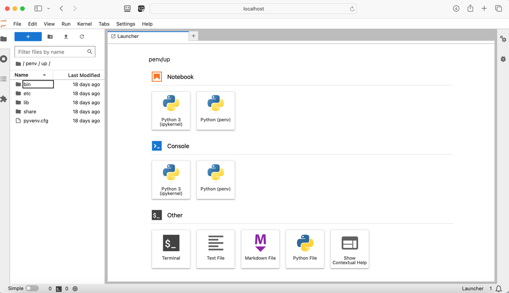

User's Guide
============

Getting Started
---------------

A new (or existing) unit process begins in openLCA (&copy; 2022 GreenDelta), in version 2.0 (or greater).
Separate instructions are available for getting started with and working in openLCA.
The minimum requirements for an openLCA project are:

* A database (.zolca) with a product system that references a process, which is the unit process you wish to model.
* Inputs and outputs connecting product and elementary flows into and out of the unit process.
* A single output product defining the functional unit of your unit process.

A Python 3.11 (or greater) environment is required with package dependencies installed as described in the README.md.
At minimum the following dependencies should be installed in your Python environment:

*  `olca-ipc <https://pypi.org/project/olca-ipc/>`_
*  `pandas <https://pypi.org/project/pandas/>`_
*  `jupyterlab <https://pypi.org/project/jupyterlab/>`_
*  `yaml <https://pyyaml.org/wiki/PyYAMLDocumentation>`_

| **Note:**  Additionally, report generation uses **`pandoc <https://pandoc.org/>`_** to convert the generated report from markdown to formats such as .pdf, .docx, .html.
| If you intend on generating a report in within your session with this notebook, please make sure to install this tool on your system.

With the above packages installed, the Jupyter Notebook environment may be started.

Intro to JupyterLab
-------------------

JupyterLab is a notebook authoring application and editing environment. It is based on the Jupyter project, which is focused on the development of tools and standards for interactive computing via computational notebooks. A **computational notebook** is a shareable document (i.e., a file) that combines computer code, plain language descriptions (i.e., text), data, visualizations, and controls. A computational notebook that is read by an editor (e.g., JupyterLab) results in an interactive environment for prototyping and explaining code, exploring data and visuals, and sharing ideas with others.

Once launched, JupyterLab provides a graphical user interface with two menu bars and a work area that be split between file editing and graphical output panes (see screenshot).

-  The lefthand-side menu bar provides quick access to your File Browser (default), Running Terminals and Kernels, Table of Contents, and Extension Manager

-  The top menu bar provides classic down-down menus for File, Edit, View, Run, Kernel, Tabs, Settings, and Help.

-  To exit JupyterLab, select "Shut Down" from the File menu (near the bottom); this stops all running processes and closes the web service. You can close the browser window after shutting down.

-  For more information on the JupyterLab interface, see here: https://jupyterlab.readthedocs.io/en/latest/

Unit Process Template
---------------------

In Jupyter Lab, find the ``up_template.ipynb`` file.

In the "Definitions" code block, there are two imports.
The first import calls the Interface class.

The Interface class is built on a class hierarchy, which depends on both the NetlOlcaReport class and NetlOlca class (see image below).

.. graphviz::

   digraph interface {
      edge [dir=back arrowtail=diamond style=dashed]
      Interface1:ss1 -> System_1 [xlabel="composition"];
      Interface1:ss2 -> System_1:ss1 [xlabel="composition"];
      edge [dir=back arrowtail=odiamond style=dashed]
      System_1:ss1 -> System_2 [xlable="composition"];

      Interface1[
         shape=plain
         label=<<table border="0" cellborder="1" cellspacing="0" cellpadding="4">
            <tr> <td> <b>Interface</b> </td> </tr>
            <tr> <td>
               <table border="0" cellborder="0" cellspacing="0" >
                  <tr> <td align="left" >+ property</td> </tr>
                  <tr> <td port="ss1" align="left" >- rd</td> </tr>
                  <tr> <td port="ss2" align="left" >- netl</td> </tr>
                  <tr> <td align="left">...</td> </tr>
               </table>
            </td> </tr>
            <tr> <td align="left">+ method ... </td> </tr>
         </table>>
      ]

      System_1[
         shape=plain
         label=<<table border="0" cellborder="1" cellspacing="0" cellpadding="4">
            <tr> <td> <b>NetlOlcaReport</b> </td> </tr>
            <tr> <td>
               <table border="0" cellborder="0" cellspacing="0" >
                  <tr> <td align="left" >+ property</td> </tr>
                  <tr> <td port="ss1" align="left" >- netlolca</td> </tr>
                  <tr> <td align="left">...</td> </tr>
               </table>
            </td> </tr>
            <tr> <td align="left">+ method ... </td> </tr>
         </table>>]
      System_2 [
         shape=plain
         label=<<table border="0" cellborder="1" cellspacing="0" cellpadding="4">
            <tr> <td> <b>NetlOlca</b> </td> </tr>
            <tr> <td>
               <table border="0" cellborder="0" cellspacing="0" >
                  <tr> <td align="left" >+ property</td> </tr>
                  <tr> <td align="left">...</td> </tr>
               </table>
            </td> </tr>
            <tr> <td align="left">+ method ... </td> </tr>
         </table>>
      ]
   }

These three classes are defined in their respective modules (linked below).

.. inheritance-diagram:: up_template.Interface

.. inheritance-diagram:: up_template.NetlOlcaReport

.. inheritance-diagram:: netlolca.NetlOlca

After running the code block in the "Definitions" section, start the menu-driven interface by running the code block in the "Interface" section.

1. Running the code cell found in the Interface section of this notebook displays the MAIN MENU with prompts to connect to a file ('f') or to an openLCA project ('o').

   a. For JSON-LD file connection, the DATA directory, which defaults to the "data" folder within the repository, is scanned for ZIP files.
      These files are presented in an ordered list to choose from.
      Select the file you want to open and confirm (using 'y').

   b. For openLCA IPC Server connection, the default PORT number is used to connect to openLCA (i.e., 8080).
      Make sure that openLCA is running, the database you want to use is active, and the IPC Server is running (under Tools, Developer tools in the menu bar).

      If the port number is different from the default, use the 'i' menu option to set it properly in the template.

2. Once connected, you will be prompted to select your unit process from the list of product systems found in your openLCA database or JSON-LD file.

3. With the unit process selected, use the MAIN MENU to:

   a. Ask about your project (option 'a').

   b. Edit certain data (option 'e').

   c. Reselect your unit process (option 'p').

   d. Generate a report (option 'r').

      Note that the OUTPUT directory where reports are saved is by default in the "output" folder.
      The report's file name is the same name as the unit process you selected.

4. At any time, hitting return (or Enter) on your keyboard brings up the MAIN MENU.

   Each menu option has help text that you can request using the 'h' with the menu option in parentheses: 'h(c)' for help with connect.

5. When finished, use the 'q' menu option to quit the interface.

6. Save the notebook and shutdown the Jupyter Notebook server before closing your browser window.

Refine your report
^^^^^^^^^^^^^^^^^^

If you find information missing in the report (e.g., in the documentation section), you can make a report edit (i.e., not saved in the openLCA database or JSON-LD).

The 'r2' option in the interface generates a `markdown <https://daringfireball.net/projects/markdown/>` formatted plain text file.
This basic style is the foundation for each other report format (e.g., HTML, Microsoft Word, and PDF) and is easily edited in Jupyter Lab (or any text editor).
Changes may be made to the markdown version of the report, saved, and used to generated other formats---even without connecting to an openLCA project or JSON-LD (assuming the markdown report already exists).

**Example:**
After running the interface section of the UP template and quitting, open the .md file that was created and you see a typo or missing information that you correct and save.
In a new code cell at the bottom of the notebook, you can run the following to generate a new HTML file.

.. code-block:: python

   >>> mc.rd.get_file_path()   # see where unit process file is
   >>> mc.rd.convert_to_html() # reads .md and translates to .html

**Warning:**
Re-saving to markdown (option 'r2') will overwrite any changes you made to the text file.
