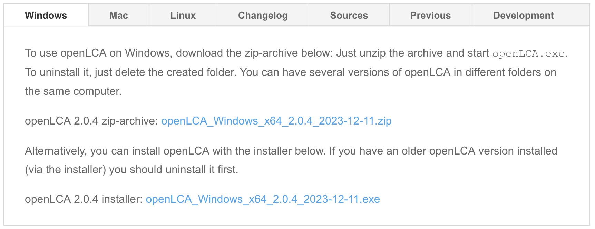

Overview
========

NETL is in the process of replacing the traditional unit process template (consisting of a the DS/DF pair) with a single Jupyter notebook file.
The Jupyter notebook takes advantage of the latest tools and software capabilities of GreenDelta's openLCA to provide a single interface for reviewing and reporting unit processes.

The prerequisites for using the new unit process template include:

-  A working Python interpreter (version 3.11 or greater)
-  openLCA application (version 2.0.0 or greater)
-  An up-to-date modern web browser (e.g., Chrome, Firefox, Safari, or equivalent)

The installation of a Python interpreter on your computer may require some familiarity of the command line (or terminal) and is covered in the following sections of this user guide: Python on Windows and Python on macOS.
All modern computers come preinstalled with a web browser (e.g., Edge on Windows and Safari on macOS); however, third-party browsers may also be installed on your machine (e.g., Firefox) to be used with this template.

GreenDelta's openLCA is an open-source Java-based application and can be installed for all major operating systems (e.g., Windows, macOS, and Linux) from their website: https://www.openlca.org/ (see screenshot below, noting the operating system choices in the menu).
GreenDelta also provides documentation and training under the Learning & Support section of their website.
The source code for openLCA may be found on GitHub: https://github.com/GreenDelta/olca-app.

